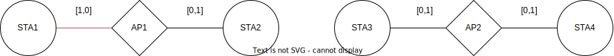
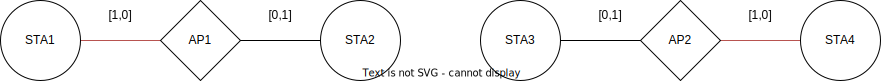

# MAB Action Space

Let $\mathcal{A}=\{A_1,A_2,\ldots A_{N_a}\}$ be the set access points
and $\mathcal{S}$ be the set of stations. Each station is connected to
single access point and the set of stations associated with a given AP
$A\in \mathcal{A}$ is denoted as $\mathcal{N}(A)$.

An MAPC C-SR decision is made according to the following procedure:

1. $A_k$ wins channel contention (based on DCF outcome, which can be
    approximated by RR scheduling).  $N_a$ possibilities] 

1. $A_k$ selects station $S_l\in \mathcal{N}(A_k)$ for downlink
    transmission (approximated by RR scheduling). [$|\mathcal{N}(A_k)|$
    possibilities]{style="color: red"}

1. Select a set $\mathcal{F}_{k,l}$ of zero or more APs from
    $2^{\mathcal{A}\setminus\{A_k\}}$, where $2^{(\cdot)}$ denotes the
    power set. [$2^{N_a-1}$ possibilities]{style="color: red"}

1. Pick one or more element from a set
    $\{(a,s): a\in \mathcal{F}_{k,l}, \quad s\in \mathcal{N}(a)\}$.

Implementation proposal: construct all action spaces using *itertools*
and build inverse LUT for selected AP and stations using
*jax.experimental.sparse*, this way we should avoid recompilation.

### [colab](https://colab.research.google.com/drive/1ihbJpcRQ9wl_pgec38BkPF2hd_JglUWi?usp=sharing)

## TS

1.  agent applies a sequence of actions
    $x_1, x_2, x_3,\ldots \in \mathcal{X}$ to a system

2.  applying action $x_t$, the agent observes an outcome $y_t$, which
    the system randomly generates, according to a conditional probability
    measure $q_\theta(\cdot | x_t)$

3.  The agent enjoys a reward $r_t = r(y_t)$, where $r$ is a known
    function.

4.  The agent is initially uncertain about the value of $\theta$ and
    represents his uncertainty using a prior distribution $p$.

TODO: $q$=?, $r$=?

## Probability distribution

Assuming we have up to $m$ APs in simultaneous operation that are
correlated, the output distribution can be expressed by a log
probability, e.g., :
$$\log P_{q_\theta}(\mathbf y|x_t)=\sum_i \alpha_i  y_i+ \sum_{i,j}\beta_{i,j} y_i y_j + \sum_{i,j,k}\gamma_{i,j,k}y_i y_j y_k + \ldots.$$
Note that $\theta_{i_k}$ must be invariant to index permutation.

TODO:

1.  conjugate prior for $P(\mathbf y)$

2.  Sample from conjugate prior

3.  Update conjugate prior

# Conclusions regarding the implementation

1. Round Robin 
1. Round Robin 
1. $1$ agent per $1$ STA (Each STA has assigned AP.
Next steps) -- Dict\[STA $\rightarrow$ MAB\] 
    - No. Agents:$\| \mathcal{S}\|$ 
    - No. Actions: $\|2^{\mathcal{A}\setminus\{A_k\}}\|$
1.  $1$ agent per $1$ element of the power set $2^{\mathcal{A}}$ --Dict\[$a\in 2^{\mathcal{A}}$ $\rightarrow$ MAB\] 
    - No. Agents: $\|2^{N_{AP}} - N_{AP} -1\|$ 
    - No. Actions: $\Pi_{i \in \mathcal{F}_{k,l}} N_{STA}^{i}$

# Stateful/Contextful Approach

Define the network state at time $t$ as a graph $G_t=(V,E)$, where
$V=\mathcal{A}\cup \mathcal{S}$ and $E=\{(S,A): S\in \mathcal{N}(A)\}$.
Furthermore, introduce the edge attributes $\mathbf x$ to be one-hot encoded
information if the pair $(S,A)$ has been granted transmission.

The action space corresponds to the available edges to be allowed for
transmission. We can express the action.

Action is taken by the policy function $\pi(\mathbf w_p, z_t)$, where $z_t$
is an agent state, and it consists of a sequence of network states
$z_t=(G_{t-H}\ldots,G_{t-1},G_t)$. The policy network is a GNN
parameterized by weights $\mathbf w_p$. In a similar way we can define value
function and construct any RL algorithm for this problem.

Such an approach is quite general, and we can skip relation between
station and APs, let this to be learned by using full bipartite graph.

Let us walk through a simple example.

Assuming AP1 is selected by RR and STA1 is allowed to transmit, the configuration looks as follows.

The policy represents four possible actions corresponding to the edges in the graph.
Depending on the algorithm, an action is chosen. Let it be to allow station STA4 to transmit.

Network configuration now looks like

